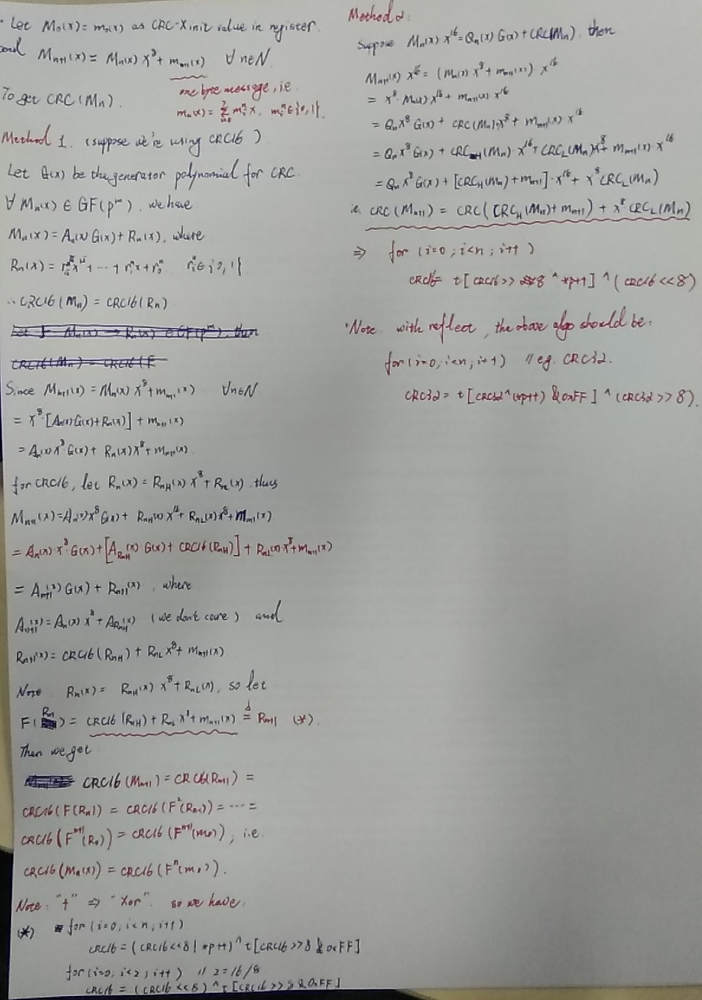

## Sth about CRC(Cyclic Redundancy Check)

### GF: Galois(Évariste Galois) Field
```
1. GF(p)
(1) 当且仅当p为素数时, 构成有限域. 加法/乘法同商空间.
(2) 阶(元素个数): p.

2. GF(p^m)
(1) 当且仅当p为素数时, 构成有限域. 加法/乘法同商空间上的多项式运算.
(2) 特征: p; 阶(元素个数): p^n.
(3) 多项式系数为素(数)域GF(p), 最常见的为二元域(即: p=2).
(4) 全体非0元素集合构成有限乘群, 且每个元素的级有限. 该群为循环群, 必存在生成元.
```

## Mathematical Derivation


## Industrial Standard
```
* CRC12     // for 6bit string
* CRC16     // for 8bit string, used by America
* CRC-CCITT // for 8bit string, used by Europe, X.25 FCS
* CRC32     // used by sync P2P(Point to Point), WINRAR, NERO, ARJ, LHA
```

## CRC Model Parameter
```
## e.g. CRC32
Name:   "CRC-32"
Width:  32
Poly:   04C11DB7    <- Reflect ->   EDB88320
Init:   FFFFFFFF
RefIn:  True        e.g. "1"(0x31: 00110001) => 0x8C: 10001100; 0x31 32 33 34 => 0x8C 4C CC 2C
RefOut: True        e.g. 0x31 32 33 34 => 0x2C CC 4C 8C
XorOut: FFFFFFFF
Check:  CBF43926
```